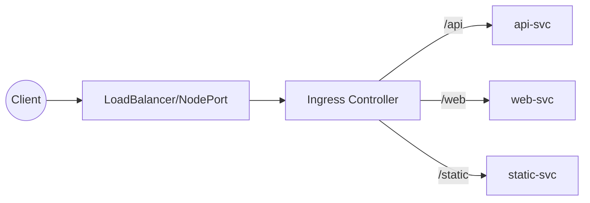

# 从零开始的云原生之旅（十二）：从 Service 到 Ingress——K8s 服务暴露完全指南

> 这一篇承上启下：梳理 Kubernetes Service 全家桶的暴露方式，帮你判断何时需要引入 Ingress，以及在架构演进中如何逐步升级流量入口。

## 📖 文章目录

- [前言：为什么要在动手前先厘清入口方案？](#前言为什么要在动手前先厘清入口方案)
- [一、服务暴露的四块拼图](#一服务暴露的四块拼图)
  - [1.1 ClusterIP：集群内的基础流量交换机](#11-clusterip集群内的基础流量交换机)
  - [1.2 NodePort：最直接的外部访问方式](#12-nodeport最直接的外部访问方式)
  - [1.3 LoadBalancer：云环境的标准入口](#13-loadbalancer云环境的标准入口)
  - [1.4 ExternalName：为老系统提供过渡桥梁](#14-externalname为老系统提供过渡桥梁)
- [二、从四种 Service 到 Ingress：关键问题解析](#二从四种-service-到-ingress关键问题解析)
- [三、典型架构演进：单体 → 多服务 → 统一入口](#三典型架构演进单体--多服务--统一入口)
- [四、实战示例：一步步接入 Ingress](#四实战示例一步步接入-ingress)
  - [4.1 编写 Service 与 Deployment](#41-编写-service-与-deployment)
  - [4.2 暴露 NodePort 进行基础联调](#42-暴露-nodeport-进行基础联调)
  - [4.3 引入 Ingress 统一域名与路径](#43-引入-ingress-统一域名与路径)
- [五、决策清单：什么时候从 Service 升级到 Ingress？](#五决策清单什么时候从-service-升级到-ingress)
- [六、常见误区与排查建议](#六常见误区与排查建议)
- [七、知识延伸：为 Ingress 深度剖析做准备](#七知识延伸为-ingress-深度剖析做准备)
- [结语：保持架构的弹性与节奏](#结语保持架构的弹性与节奏)

---

## 前言：为什么要在动手前先厘清入口方案？

很多团队在部署第一个 Kubernetes 集群时，往往一头扎进 Ingress 或 Istio，却忽视了 Service 本身已经提供了多种暴露方式。结果就是：

- 明明只是内部系统，却提前上了 Ingress，增加复杂度；
- 对外暴露服务时没有规划 IP、端口，导致测试和生产配置割裂；
- 旧系统需要访问集群内部服务，却被迫走 NodePort，性能与安全双输。

因此，本篇目标非常明确：**厘清 Kubernetes 服务暴露的基石**，给出一条渐进式演进路径，让后续的 Ingress、服务网格决策都有据可依。

---

## 一、服务暴露的四块拼图

### 1.1 ClusterIP：集群内的基础流量交换机

```yaml
apiVersion: v1
kind: Service
metadata:
  name: api-svc
spec:
  type: ClusterIP
  selector:
    app: api
  ports:
  - port: 8080
    targetPort: 8080
```

- **定位**：默认创建的 Service 类型，只在集群内部可达。
- **能力**：提供稳定虚拟 IP（ClusterIP），屏蔽 Pod 变动。
- **适用**：微服务之间的东西向流量；前端 Pod 调用后端 API。
- **限制**：无法被集群外直接访问，需要配合其他方式暴露。

> 📌 记住：Kubernetes 中真正的“Service 发现”是由 ClusterIP 提供的。

### 1.2 NodePort：最直接的外部访问方式

```yaml
spec:
  type: NodePort
  ports:
  - port: 80
    targetPort: 8080
    nodePort: 30080
```

- **定位**：在每个 Node 上打开同一个端口对外提供访问。
- **优点**：部署简单、无需额外负载均衡。
- **缺点**：端口暴露在所有节点上，存在安全风险；端口区间受限（30000-32767）。
- **常见用途**：
  - 本地/测试环境快速验证；
  - 与外部硬件负载均衡器对接时的后端目标。

### 1.3 LoadBalancer：云环境的标准入口

在云平台（如 AWS、GCP、阿里云）上，Service 设置为 `LoadBalancer` 会自动申请云负载均衡。

| 维度 | 说明 |
|------|------|
| 优点 | 一键获得公网入口、健康检查、弹性扩缩支撑 |
| 成本 | 需要付费（按时或按流量），并受限于云厂商能力 |
| 场景 | 面向公网的 API、落地到云平台的正式环境 |

本质上，LoadBalancer 仍然是对 NodePort 的进一步封装：云 LB 会将请求转发到 Node 上暴露的端口。集群内部依旧通过 ClusterIP 做服务发现。

### 1.4 ExternalName：为老系统提供过渡桥梁

```yaml
apiVersion: v1
kind: Service
metadata:
  name: legacy-db
spec:
  type: ExternalName
  externalName: db.prod.example.com
```

- **定位**：将 DNS 查询直接 CNAME 到外部域名。
- **作用**：统一服务发现入口，让集群内应用以 Service 名称连接旧系统。
- **限制**：不是真正的代理，没有负载均衡与健康检查，只是 DNS 层映射。

> 当你在迁移遗留系统时，ExternalName 可以作为“过渡层”，帮助新旧系统解耦命名方式。

---

## 二、从四种 Service 到 Ingress：关键问题解析

当系统逐渐复杂，我们会遇到以下痛点：

1. **域名管理困难**：NodePort 只提供端口，没有域名；LoadBalancer 需要为每个服务申请一个公网入口。
2. **路径路由缺失**：想让 `/api` 和 `/web` 指向不同服务，NodePort / LoadBalancer 无法在 L4 层完成。
3. **HTTPS 统一管理**：为每个 Service 单独配置证书既费时又难维护。
4. **灰度与策略**：基础 Service 无法识别 Header、Cookie，更谈不上金丝雀发布。

这时，Ingress 登场：它在 **L7（应用层）** 提供路由、证书、重写等能力，复用现有 Service 作为后端目标。可以把它理解为“为 Service 加了一层反向代理和策略引擎”。



---

## 三、典型架构演进：单体 → 多服务 → 统一入口

```text
阶段A：单体应用
浏览器 → NodePort → Pod

阶段B：多服务拆分
外部 → LoadBalancer → 多个 Service

阶段C：统一入口
外部 → LoadBalancer → Ingress Controller → Service → Pod
```

> ⭐️ 建议采用“先 Service、再 Ingress”的节奏。只有当多个服务需要统一入口或策略治理时，再引入 Ingress，避免过早增加复杂度。

---

## 四、实战示例：一步步接入 Ingress

### 4.1 编写 Service 与 Deployment

```yaml
# deployment.yaml
apiVersion: apps/v1
kind: Deployment
metadata:
  name: api
spec:
  replicas: 3
  selector:
    matchLabels:
      app: api
  template:
    metadata:
      labels:
        app: api
    spec:
      containers:
      - name: api
        image: ghcr.io/example/api:v1
        ports:
        - containerPort: 8080
```

配套 Service：

```yaml
# service.yaml
apiVersion: v1
kind: Service
metadata:
  name: api-svc
spec:
  selector:
    app: api
  ports:
  - port: 8080
    targetPort: 8080
```

### 4.2 暴露 NodePort 进行基础联调

```bash
# 临时将 Service 改为 NodePort
kubectl patch svc api-svc -p '{"spec": {"type": "NodePort"}}'

# 查看端口
kubectl get svc api-svc
# NAME      TYPE       CLUSTER-IP    PORT(S)           NODE-PORT
# api-svc   NodePort   10.0.0.12     8080/TCP          30321/TCP

# 在开发机验证
curl http://<NodeIP>:30321/healthz
```

这一阶段主要用于联调与确认路由逻辑，确保后端容器正常工作。

### 4.3 引入 Ingress 统一域名与路径

```yaml
apiVersion: networking.k8s.io/v1
kind: Ingress
metadata:
  name: app-ingress
  annotations:
    nginx.ingress.kubernetes.io/rewrite-target: /$1
spec:
  ingressClassName: nginx
  rules:
  - host: app.local
    http:
      paths:
      - path: /api(/|$)(.*)
        pathType: Prefix
        backend:
          service:
            name: api-svc
            port:
              number: 8080
      - path: /(.*)
        pathType: Prefix
        backend:
          service:
            name: web-svc
            port:
              number: 80
```

- `ingressClassName` 指定控制器（如 Nginx）。
- `rewrite-target` 注解规整后端路径。
- 通过单一域名 `app.local` 暴露多个服务。

> 到此，我们完成了 Service → Ingress 的演进：底层依然是 ClusterIP/NodePort，Ingress 只是附加的 L7 策略层。

---

## 五、决策清单：什么时候从 Service 升级到 Ingress？

| 场景 | 是否需要 Ingress | 说明 |
|------|-----------------|------|
| 内部系统，只需集群内互访 | ❌ | ClusterIP 足够，借助 Service DNS 即可 |
| 临时演示/联调，需要快速暴露 | ⚠️ 可选 | NodePort 最直接，但记得回收端口 |
| 云上生产环境，每个服务都需要公网入口 | ✅ | LoadBalancer + Ingress 组合，节省 IP 和证书成本 |
| 希望按照路径/域名划分流量 | ✅ | Ingress 提供 L7 路由能力 |
| 需要统一 TLS、鉴权、WAF 策略 | ✅ | Ingress 注解 + 控制器可扩展 |
| 计划实施金丝雀/熔断/限流 | 🚨 | Ingress 能力有限，应评估服务网格（Istio 等） |

> 牢记“从简到繁”的原则：Ingress 是对 Service 的增强，不是替代。先把 Service 配置扎实，再考虑引入更高层的治理能力。

---

## 六、常见误区与排查建议

1. **误区：以为创建 Ingress 就能访问**
   - ✅ 实际上需要运行 Ingress Controller（如 Nginx、Traefik）。
   - 检查：`kubectl get pods -n ingress-nginx`。

2. **误区：忘记更新本地 hosts 或 DNS**
   - ✅ L7 路由依赖 Host Header，务必在测试机上配置 `app.local`。

3. **误区：PathType 设置不当**
   - ✅ `Prefix` 和 `Exact` 匹配方式不同；对于 REST API，推荐使用 `Prefix`。

4. **误区：忽视 Service 选择器**
   - ✅ 如果 Service 的 `selector` 与 Pod 标签不匹配，会导致 Ingress 返回 503。

5. **排查流程建议**：

```text
1. kubectl get svc -n ingress-nginx         # 控制器 Service 是否就绪？
2. kubectl describe ingress app-ingress     # 规则是否生效？有无事件报错？
3. kubectl get endpoints api-svc            # Service 是否指向 Pod？
4. curl -H "Host: app.local" http://<LB>/  # 指定 Host 进行访问
```

---

## 七、知识延伸：为 Ingress 深度剖析做准备

接下来你会在《Ingress 深度剖析：从 Service 到统一入口》中看到：

- 更细致的 Ingress 规范字段解释（IngressClass、默认后端、PathType）。
- 控制面、数据面的多种实现选择。
- TLS、注解、请求生命周期的高级玩法。

提前把 Service 的基础打牢，会让你在理解 Ingress 架构时更游刃有余。

---

## 结语：保持架构的弹性与节奏

Kubernetes 提供的 Service 类型就像拼图：按需组合即可构建出适合团队规模的流量路径。不要一开始就追求“大而全”的方案，而是遵循以下节奏：

1. **ClusterIP 夯实服务发现**：保证内部调用稳定。
2. **NodePort/LoadBalancer 快速暴露**：在不同环境满足访问需求。
3. **Ingress 统一入口**：当服务数量、策略需求增加时再引入。
4. **服务网格**：在需要东西向治理与高级流量控制时再升级。

下一篇，我们将顺势深入 Ingress 世界，解锁更多 L7 路由与策略细节。

> 🌟 架构没有银弹，适度演进才能保持系统的可维护性与韧性。
