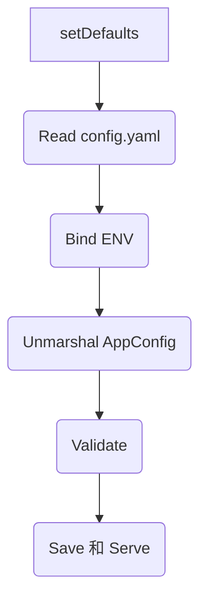

# 从零开始的云原生之旅（十七）：K8s 配置管理最佳实践

> v0.5 版本的核心目标，是把“能跑”升级为“跑得稳”。这一篇，带你完整梳理我们在 Kubernetes 上构建配置体系的全过程：如何规划多环境、如何设计优先级、如何做到验证可控以及敏感信息的安全管理。

---

## 🧭 文章导航

- [一、为什么 v0.5 必须重构配置管理？](#一为什么-v05-必须重构配置管理)
- [二、四层优先级的配置加载体系](#二四层优先级的配置加载体系)
- [三、多环境管理：Kustomize + ConfigMap Patch](#三多环境管理kustomize--configmap-patch)
- [四、Fail-Fast + Fail-Safe：配置验证与回滚](#四fail-fast--fail-safe配置验证与回滚)
- [五、敏感信息与脱敏输出](#五敏感信息与脱敏输出)
- [六、配置变更操作手册（Dev → Prod）](#六配置变更操作手册dev--prod)
- [七、常见坑与排查建议](#七常见坑与排查建议)
- [八、总结：v0.5 带来的提升与展望](#八总结v05-带来的提升与展望)

---

## 一、为什么 v0.5 必须重构配置管理？

回顾 v0.4，我们的后端应用只通过环境变量驱动：配置项零散、缺乏默认值、敏感信息和常规配置混杂在一起，更别提热更新和结构化验证。一旦配置写错，只能暴力重启 Pod，排查靠“肉眼 diff”。

v0.5 重新设计的目标：

1. **多环境差异清晰**：dev/staging/prod 能独立演进。
2. **优先级可控**：默认值、ConfigMap、环境变量各司其职。
3. **验证可追踪**：失败要么“启动前就暴露”，要么“运行时保持旧配置”。
4. **敏感信息隔离**：密码类数据不落盘，走 Secret / 环境变量。
5. **热更新友好**：更新 ConfigMap 后无需重启即可生效。

---

## 二、四层优先级的配置加载体系

配置管理器 `Manager` 负责统一加载、验证、存储配置，按照“默认值 → 配置文件 → 环境变量 → 热更新”的顺序叠加。核心流程在 `Load()` 函数中实现：@src/backend/config/config.go#36-81



- **默认值**：`setDefaults` 确保关键字段即使在 ConfigMap 缺失时仍有兜底值。@src/backend/config/default.go#1-45
- **配置文件**：从 `/etc/config/config.yaml` 读取 K8s ConfigMap 挂载内容，同时兼容本地 `./config` 目录。
- **环境变量**：自动绑定所有字段，并对敏感数据（Redis/DB）单独声明，允许运维在不修改 ConfigMap 的前提下调整密码。@src/backend/config/config.go#83-110
- **热更新**：fsnotify 监听配置文件，触发 `reload()` 在运行时更新内存中的配置，详见下一篇博客。

这种层级保证了“默认值解决未配置的问题，ConfigMap 定义环境基线，环境变量负责灵活覆盖”。

---

## 三、多环境管理：Kustomize + ConfigMap Patch

我们采用 **base + overlays** 的目录结构描述多环境差异：@k8s/v0.5#1-999

```text
k8s/v0.5/
├── base/
│   ├── deployment.yaml
│   ├── service.yaml
│   └── configmap.yaml
└── overlays/
    ├── dev/
    │   ├── kustomization.yaml
    │   ├── deployment-patch.yaml
    │   └── configmap-patch.yaml
    ├── staging/
    └── prod/
```

**为什么放弃 `configMapGenerator + files`？**

- `files:` 会把整个文件当作二进制 blob，无法保留 YAML 缩进；
- 变更时难以局部 diff；
- 容易出现 `ENVIRONMENT=dev` 这样的拼写问题。我们改用 `patchesStrategicMerge`，直接覆盖 ConfigMap 的 YAML 内容。

以 dev 环境为例：@k8s/v0.5/overlays/dev/configmap-patch.yaml#1-34

```yaml
server:
  environment: "development"
  version: "v0.5.0-dev"

log:
  level: "debug"
  enable_stacktrace: true

redis:
  pool_size: 5
```

而 staging、prod 则通过独立的 patch 控制日志级别、版本号、开关项，实现“只改差异，不动基线”。

部署流程完全一致：

```powershell
kubectl apply -k k8s\v0.5\overlays\dev
kubectl apply -k k8s\v0.5\overlays\staging
kubectl apply -k k8s\v0.5\overlays\prod
```

dev → staging → prod 全链路命令都收录在《DEPLOYMENT-COMMANDS.md》中，可直接复制实践。@docs/v0.5/DEPLOYMENT-COMMANDS.md#101-198

---

## 四、Fail-Fast + Fail-Safe：配置验证与回滚

配置结构体全面打上 `validate` 标签，例如 `server.environment` 只能是 `development/staging/production`：@src/backend/config/types.go#14-23

验证策略分两阶段：

| 场景 | 策略 | 代码位置 |
|------|------|----------|
| **启动阶段** | Fail-Fast：只要解析/验证失败，直接报错并退出 | @src/backend/config/config.go#69-81 |
| **运行阶段** | Fail-Safe：热更新失败时保留旧配置，记录日志 | @src/backend/config/watcher.go#27-41 |

这套机制在实战中立了大功——我们曾尝试把 `ENVIRONMENT` 设置为 `dev`，验证器立即拒绝，避免了错误配置扩散。

---

## 五、敏感信息与脱敏输出

- **敏感字段**（Redis/DB 密码）只接受环境变量注入，不会写入 ConfigMap。@src/backend/config/config.go#92-110
- **配置 API** 对输出进行脱敏，例如去掉密码、掩盖敏感字段，方便运维排查又不泄露信息。@src/backend/handler/config.go#77-207
- `.env.example` 提供所需变量清单，建议在生产中交由 Secret 管理，而非 ConfigMap。

---

## 六、配置变更操作手册（Dev → Prod）

- **本地验证**：编辑 `config/config.yaml`，运行 `go run main.go` 确认无验证错误。
- **推送到 dev**：

```powershell
kubectl apply -k k8s\v0.5\overlays\dev
kubectl logs -l env=dev --tail=30
kubectl exec $(kubectl get pods -l env=dev -o name) -- cat /etc/config/config.yaml
```

- **热更新验证**：`kubectl edit configmap dev-api-config`，等待 kubelet 同步后通过配置 API 检查是否生效。

- **迁移到 staging / prod**：重复上述步骤，但注意 prod 关闭了配置 API。@k8s/v0.5/overlays/prod/configmap-patch.yaml#1-34

- **回滚预案**：保留以前的 ConfigMap 版本或使用 Git 回退，重新 `kubectl apply -k` 即可。

更详细的命令、端口转发、日志排查脚本，请参考运维手册：@docs/v0.5/DEPLOYMENT-COMMANDS.md#161-457

---

## 七、常见坑与排查建议

| 现象 | 可能原因 | 排查建议 |
|------|----------|----------|
| 容器 CrashLoopBackOff，日志提示 `Environment` 验证失败 | 仍有环境变量覆盖为 `dev` | 删除 Deployment 中的 `ENVIRONMENT` 注入，完全依赖 ConfigMap @k8s/v0.5/base/deployment.yaml#21-46 |
| ConfigMap 修改后未生效 | kubelet 同步有延迟（默认 60~120 秒） | `kubectl exec` 查看 `/etc/config` 下的时间戳目录，确认是否已切换 |
| 配置 API 返回脱敏值 | 设计如此：敏感字段不会返回完整内容 | 使用环境变量或 Secret 查询真实值 |
| 热更新失败但未回滚 | 验证失败时会保留旧配置，并输出 `❌ 配置验证失败` 日志 | 查看 `kubectl logs -l env=dev --tail=50`，确认具体错误 |

---

## 八、总结：v0.5 带来的提升与展望

- **结构化**：多环境配置被拆分、对齐，基础值由默认值兜底。
- **可靠性**：启动阶段 Fail-Fast，运行阶段 Fail-Safe，把错误挡在第一时间。
- **安全性**：敏感字段不落盘、接口脱敏输出，满足运维与安全的双重诉求。
- **可运维性**：Command 文档、脚本、热更新流程清晰明确，可复制到实际生产环境。

下一篇（十八）我们会聚焦“配置热更新”：深入分析 kubelet 如何在 Pod 文件系统制造符号链接变更、Viper 如何监听 fsnotify 事件、Go 代码怎样保持线程安全与差异对比，敬请期待。

> 架构演进之路，关键在于“渐进式改造 + 全链路验证”。把配置管理做扎实，是迈向可观测与高可用的第一步。
