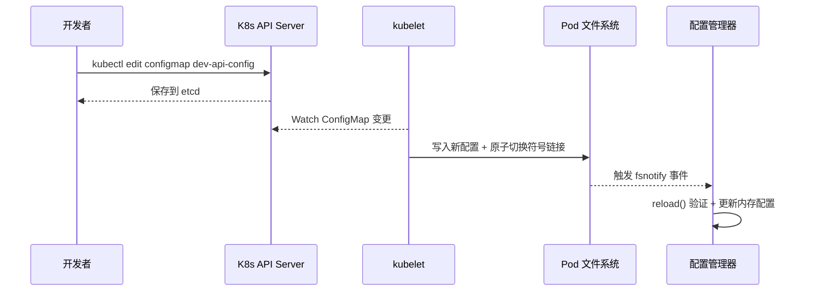

# 从零开始的云原生之旅（十八）：配置热更新——无需重启服务的幕后

> v0.5 版本让配置改动从“重启生效”进化到“秒级响应”。本文拆解一次 ConfigMap 更新背后的整条链路：Kubernetes 如何同步文件、fsnotify 如何捕获事件、Go 代码怎样做到线程安全与差异控制。

---

## 🧭 文章导航

- [一、引子：一条日志背后的热更新链路](#一引子一条日志背后的热更新链路)
- [二、总体架构：ConfigMap → kubelet → 应用](#二总体架构configmap--kubelet--应用)
- [三、Kubernetes 层：kubelet 的符号链接魔法](#三kubernetes-层kubelet-的符号链接魔法)
- [四、Go 层实现：Viper + fsnotify 热加载流程](#四go-层实现viper--fsnotify-热加载流程)
- [五、线程安全与差异控制](#五线程安全与差异控制)
- [六、如何验证热更新生效？](#六如何验证热更新生效)
- [七、常见问题与最佳实践](#七常见问题与最佳实践)
- [八、总结：一次重构带来的运维质变](#八总结一次重构带来的运维质变)

---

## 一、引子：一条日志背后的热更新链路

在 dev 环境把日志级别从 `debug` 改为 `info` 后，Pod 内立刻出现两条日志：

```text
2025/11/19 15:44:44 配置文件变更: /etc/config/config.yaml
2025/11/19 15:44:44 ✅ 配置已更新，变更项: [log.level: debug -> info]
```

这两条日志对应的事件是：

1. ConfigMap 更新被 kubelet 同步到 Pod 文件系统；
2. 应用通过 Viper 捕获变更并调用 `reload()`；
3. 新配置验证通过，差异被打印出来。

我们就沿着这条链路向下剖析。

---

## 二、总体架构：ConfigMap → kubelet → 应用



API Server 只是维护资源状态，真正把新配置同步到容器里的，是每个节点上的 kubelet。kubelet 完成文件落盘后，应用通过 fsnotify 感知变化并执行热更新。

---

## 三、Kubernetes 层：kubelet 的符号链接魔法

当 ConfigMap 发生变更时，kubelet 在宿主机上执行如下步骤：

1. 在挂载目录创建一个新的时间戳目录（例如 `..2025_11_19_15_44_44`）。
2. 写入最新的 `config.yaml`。
3. 原子地更新 `..data` 符号链接指向新目录。
4. 清理旧的时间戳目录。

容器内看到的目录结构如下（可以 `kubectl exec` 验证）：

```text
/etc/config/
├── config.yaml -> ..data/config.yaml
├── ..data -> ..2025_11_19_15_44_44
└── ..2025_11_19_15_44_44/config.yaml
```

因为符号链接切换是原子操作，应用层不会读到“半写入”的文件；同时 kubelet 在每个节点独立执行，保证多副本 Pod 最终一致。

> ⚠️ 温馨提示：kubelet 默认以 60~120 秒的频率同步 ConfigMap，等待生效时可以关注 `kubectl get events` 或直接查看 `/etc/config/..data` 的指向。

---

## 四、Go 层实现：Viper + fsnotify 热加载流程

应用侧的核心逻辑位于配置管理器 `Manager`：

1. `WatchConfig()` 启动监听，并注册回调函数。@src/backend/config/watcher.go#11-24
2. fsnotify 捕获到 `WRITE` / `CREATE` 事件后触发回调。
3. `reload()` 依次解析、验证、对比并应用新配置。@src/backend/config/watcher.go#27-89

关键代码如下：

```go
func (m *Manager) Watch() {
    m.viper.WatchConfig()
    m.viper.OnConfigChange(func(e fsnotify.Event) {
        log.Printf("配置文件变更: %s", e.Name)
        m.reload()
    })
    log.Println("配置热更新监听已启动")
}
```

`reload()` 的执行流程：

```go
func (m *Manager) reload() {
    var newCfg AppConfig
    if err := m.viper.Unmarshal(&newCfg); err != nil {
        log.Printf("❌ 配置解析失败，保留旧配置: %v", err)
        return
    }
    if err := m.Validate(&newCfg); err != nil {
        log.Printf("❌ 配置验证失败，保留旧配置: %v", err)
        return
    }

    oldCfg := m.GetConfig()
    changes := m.diff(oldCfg, &newCfg)
    if len(changes) == 0 {
        log.Println("配置无变化")
        return
    }

    m.mu.Lock()
    m.config = &newCfg
    m.mu.Unlock()

    log.Printf("✅ 配置已更新，变更项: %v", changes)
    m.notifyChange(&newCfg)
}
```

> ✅ 解析失败或验证失败时直接 `return`，旧配置保持不变，这就是运行期的 **Fail-Safe** 策略。

---

## 五、线程安全与差异控制

为了避免并发读写出现数据竞争，我们在配置管理器中使用读写锁保护共享状态，并在对外暴露配置时返回深拷贝：@src/backend/config/config.go#12-18,@src/backend/config/config.go#118-142

差异计算由 `diff()` 完成，仅比较允许热更新的字段（日志级别、Redis 连接池等），从而避免误报：@src/backend/config/watcher.go#67-121

同时，`notifyChange` 机制允许注册额外回调，例如刷新缓存、推送告警等，后续可以在这里串联更多自动化操作。

---

## 六、如何验证热更新生效？

以下流程可以在本地或 Minikube 环境复现：

```powershell
# 1. 编辑 ConfigMap
kubectl edit configmap dev-api-config

# 2. 等待 kubelet 同步（可查看目录指向）
$POD = kubectl get pods -l env=dev -o jsonpath='{.items[0].metadata.name}'
kubectl exec $POD -- ls -l /etc/config/..data

# 3. 查看应用日志
kubectl logs $POD --tail=20

# 4. 验证配置 API（dev 环境开放）
Invoke-RestMethod -Uri "http://localhost:8080/api/v1/config/log.level"
```

> 生产环境通常会关闭配置 API，可通过查看日志或 Prometheus 指标确认热更新效果。

---

## 七、常见问题与最佳实践

| 问题 | 原因分析 | 解决建议 |
|------|----------|----------|
| 热更新未触发 | ConfigMap 尚未同步到 Pod | 等待 1~2 分钟或重启 kubelet |
| 日志提示 `配置验证失败` | 新配置字段不符合验证规则 | 修正 ConfigMap，重新 `kubectl apply` |
| 配置已更新但业务未响应 | 业务层缺乏回调处理 | 在 `notifyChange` 注册刷新逻辑 |
| 多次快速修改 ConfigMap | fsnotify 事件积压 | 保持修改间隔，或重构为灰度发布流程 |

最佳实践：

- 在提交 ConfigMap 之前先本地 `go test` / `go run` 验证；
- 为关键配置编写“健康检查”回调，例如检查 Redis 连接可用性；
- 把热更新操作写进 Runbook，明确责任人和回退策略。

---

## 八、总结：一次重构带来的运维质变

- **效率**：从“改配置 + 重启”缩短到“一次 kubectl edit”，极大提升迭代速度。
- **可靠性**：Fail-Safe 策略把错误挡在日志层，服务持续可用。
- **可观测性**：从 kubelet 同步到应用日志，每一步都有迹可循。
- **扩展能力**：差异化回调可接入更多自动化场景（动态限流、告警开关等）。

下一步，我们计划在 CI/CD 管道中加入 ConfigMap 预验证，并探索基于 GitOps 的配置回滚策略，让配置变更真正做到“可审计、可回退、可追踪”。

> 配置热更新的本质，是在 Kubernetes 与应用之间搭起一条信任链。理解每一环的工作原理，就能让这条链稳定而可控。
