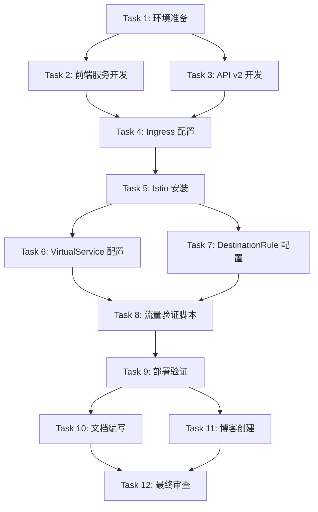

# v0.4 任务分解文档 (TASK)

> 原子任务拆分、接口规范、依赖关系

**创建时间**: 2025-11-14  
**版本**: v0.4 - 服务治理版  
**状态**: 任务分解

---

## 📋 任务分解概览

v0.4 分解为 **12 个原子任务**，按依赖关系分为 4 个阶段：



---

## 🎯 Task 1: 环境准备

**输入契约**:
- Minikube 或 Kind 集群正常运行
- kubectl 已安装
- Docker 已安装

**输出契约**:
- Nginx Ingress Controller 已启用
- Istio CLI (istioctl) 已安装
- 环境验证通过

**实现约束**:
- 使用 Minikube 内置 Ingress 支持
- 安装最新稳定版 Istio
- 记录所有安装步骤

**依赖关系**:
- 前置: 无
- 后置: Task 2, 3, 4, 5

**验收标准**:
- [ ] `minikube addons enable ingress` 成功
- [ ] `istioctl version` 返回版本信息
- [ ] `kubectl get pods -n ingress-nginx` 显示 Ingress 控制器
- [ ] 环境检查脚本通过

---

## 🎯 Task 2: 前端服务开发

**输入契约**:
- Go 1.23+ 环境
- 现有项目代码结构
- Gin 框架已集成

**输出契约**:
- 前端处理器代码 (`src/handler/frontend.go`)
- 前端 HTML 页面
- 前端服务单元测试

**实现约束**:
- 遵循现有代码风格
- 返回简单 HTML 页面
- 包含系统架构展示
- 包含流量分配信息显示

**依赖关系**:
- 前置: Task 1
- 后置: Task 4

**验收标准**:
- [ ] 代码编译通过
- [ ] 单元测试通过
- [ ] 本地运行正常
- [ ] 返回 HTML 页面正确

---

## 🎯 Task 3: API v2 开发

**输入契约**:
- 现有 API v1 代码
- 版本标识机制

**输出契约**:
- API v2 Dockerfile
- 版本接口 (`/api/v1/version`)
- v2 标识

**实现约束**:
- 复用 v1 代码
- 修改版本标识为 "v2"
- 添加 `/api/v1/version` 接口
- 构建新的 Docker 镜像

**依赖关系**:
- 前置: Task 1
- 后置: Task 4

**验收标准**:
- [ ] Dockerfile 构建成功
- [ ] Docker 镜像大小 < 50MB
- [ ] `/api/v1/version` 返回 `{"version": "v2"}`
- [ ] 镜像推送到本地仓库

---

## 🎯 Task 4: Ingress 配置

**输入契约**:
- Nginx Ingress Controller 已启用
- Frontend Service 已部署
- API Service 已部署

**输出契约**:
- Ingress 配置文件 (`k8s/v0.4/ingress/ingress.yaml`)
- Ingress 部署脚本
- Ingress 验证脚本

**实现约束**:
- 支持基于路径的路由
- 支持域名 `app.local`
- 配置清晰易懂
- 包含注释说明

**依赖关系**:
- 前置: Task 1, 2, 3
- 后置: Task 8

**验收标准**:
- [ ] Ingress 创建成功
- [ ] `kubectl get ingress` 显示配置
- [ ] `/api` 路由到 api-service
- [ ] `/` 路由到 frontend-service
- [ ] 通过 curl 测试验证

---

## 🎯 Task 5: Istio 安装

**输入契约**:
- Kubernetes 集群正常运行
- istioctl 已安装
- 资源充足（4 CPU，8GB RAM）

**输出契约**:
- Istio 控制平面已部署
- Envoy Sidecar 自动注入已启用
- Istio 验证通过

**实现约束**:
- 使用 Demo 模式安装
- 启用自动注入
- 记录安装步骤
- 提供故障排查方案

**依赖关系**:
- 前置: Task 1
- 后置: Task 6, 7

**验收标准**:
- [ ] `istioctl install --set profile=demo -y` 成功
- [ ] `kubectl get pods -n istio-system` 显示 Istiod
- [ ] `kubectl label namespace default istio-injection=enabled` 成功
- [ ] 新部署的 Pod 自动注入 Envoy

---

## 🎯 Task 6: VirtualService 配置

**输入契约**:
- Istio 已安装
- API v1 和 v2 Deployment 已部署
- Pod 已自动注入 Envoy

**输出契约**:
- VirtualService 配置文件 (`k8s/v0.4/istio/virtual-service.yaml`)
- 配置说明文档
- 验证脚本

**实现约束**:
- 配置 90/10 流量分流
- 支持超时和重试
- 配置清晰有注释
- 包含多个示例

**依赖关系**:
- 前置: Task 5
- 后置: Task 8

**验收标准**:
- [ ] VirtualService 创建成功
- [ ] `kubectl get virtualservices` 显示配置
- [ ] 权重配置正确（90/10）
- [ ] 超时和重试配置正确

---

## 🎯 Task 7: DestinationRule 配置

**输入契约**:
- Istio 已安装
- API v1 和 v2 Pod 已部署并标记版本标签

**输出契约**:
- DestinationRule 配置文件 (`k8s/v0.4/istio/destination-rule.yaml`)
- 配置说明文档
- 验证脚本

**实现约束**:
- 定义 v1 和 v2 子集
- 配置连接池
- 配置熔断检测
- 配置清晰有注释

**依赖关系**:
- 前置: Task 5
- 后置: Task 8

**验收标准**:
- [ ] DestinationRule 创建成功
- [ ] `kubectl get destinationrules` 显示配置
- [ ] 子集定义正确（v1, v2）
- [ ] 连接池配置正确

---

## 🎯 Task 8: 流量验证脚本

**输入契约**:
- Ingress 已配置
- VirtualService 已配置
- DestinationRule 已配置
- API 服务正常运行

**输出契约**:
- 流量验证脚本 (`scripts/traffic-verify.sh`)
- 验证结果报告
- 验证方法文档

**实现约束**:
- 发送 100+ 个请求
- 统计 v1 和 v2 的比例
- 验证准确度 > 90%
- 脚本可复用

**依赖关系**:
- 前置: Task 4, 6, 7
- 后置: Task 9

**验收标准**:
- [ ] 脚本执行成功
- [ ] 统计结果准确
- [ ] v1 比例在 85%-95%
- [ ] v2 比例在 5%-15%

---

## 🎯 Task 9: 部署验证

**输入契约**:
- 所有组件已部署
- 流量验证脚本已运行
- 系统正常运行

**输出契约**:
- 完整的部署验证报告
- 故障排查文档
- 部署检查清单

**实现约束**:
- 验证所有组件
- 记录所有指标
- 提供故障排查方案
- 生成验证报告

**依赖关系**:
- 前置: Task 8
- 后置: Task 10, 11

**验收标准**:
- [ ] Ingress 正常工作
- [ ] Istio 正常工作
- [ ] 金丝雀发布验证通过
- [ ] 所有 Pod 正常运行

---

## 🎯 Task 10: 文档编写

**输入契约**:
- 所有代码已完成
- 所有配置已验证
- 部署流程已确认

**输出契约**:
- 部署指南 (`docs/v0.4/DEPLOYMENT-GUIDE.md`)
- 架构说明 (`docs/v0.4/ARCHITECTURE.md`)
- 故障排查 (`docs/v0.4/TROUBLESHOOTING.md`)
- 版本概述 (`docs/v0.4/README.md`)

**实现约束**:
- 文档清晰易懂
- 包含完整的步骤
- 包含故障排查
- 包含最佳实践

**依赖关系**:
- 前置: Task 9
- 后置: Task 12

**验收标准**:
- [ ] 部署指南完整
- [ ] 步骤清晰可执行
- [ ] 故障排查全面
- [ ] 文档格式规范

---

## 🎯 Task 11: 博客创建

**输入契约**:
- 所有代码已完成
- 所有配置已验证
- 部署流程已确认

**输出契约**:
- 4 篇博客文章
  - 博客 1: Ingress 完全指南
  - 博客 2: Ingress Controller 实战
  - 博客 3: Istio 服务网格介绍
  - 博客 4: 金丝雀发布实战

**实现约束**:
- 每篇 2000+ 字
- 包含代码示例
- 包含架构图
- 包含实战演示

**依赖关系**:
- 前置: Task 9
- 后置: Task 12

**验收标准**:
- [ ] 4 篇博客完成
- [ ] 内容专业准确
- [ ] 代码示例正确
- [ ] 排版格式规范

---

## 🎯 Task 12: 最终审查

**输入契约**:
- 所有任务已完成
- 所有文档已编写
- 所有博客已创建

**输出契约**:
- 最终审查报告
- 质量评估
- 交付清单

**实现约束**:
- 检查所有交付物
- 验证质量标准
- 生成最终报告
- 记录待办事项

**依赖关系**:
- 前置: Task 10, 11
- 后置: 无

**验收标准**:
- [ ] 所有代码审查通过
- [ ] 所有文档审查通过
- [ ] 所有博客审查通过
- [ ] 质量指标达标

---

## 📊 任务依赖关系表

| Task | 名称 | 前置 | 后置 | 优先级 |
|------|------|------|------|--------|
| 1 | 环境准备 | 无 | 2,3,4,5 | P0 |
| 2 | 前端服务开发 | 1 | 4 | P0 |
| 3 | API v2 开发 | 1 | 4 | P0 |
| 4 | Ingress 配置 | 1,2,3 | 8 | P0 |
| 5 | Istio 安装 | 1 | 6,7 | P0 |
| 6 | VirtualService 配置 | 5 | 8 | P0 |
| 7 | DestinationRule 配置 | 5 | 8 | P0 |
| 8 | 流量验证脚本 | 4,6,7 | 9 | P0 |
| 9 | 部署验证 | 8 | 10,11 | P0 |
| 10 | 文档编写 | 9 | 12 | P1 |
| 11 | 博客创建 | 9 | 12 | P1 |
| 12 | 最终审查 | 10,11 | 无 | P1 |

---

## ⏱️ 时间估算

| Task | 估算时间 | 难度 |
|------|---------|------|
| 1 | 1 小时 | ⭐ |
| 2 | 1.5 小时 | ⭐⭐ |
| 3 | 1 小时 | ⭐ |
| 4 | 1.5 小时 | ⭐⭐ |
| 5 | 1.5 小时 | ⭐⭐ |
| 6 | 1.5 小时 | ⭐⭐ |
| 7 | 1.5 小时 | ⭐⭐ |
| 8 | 1 小时 | ⭐ |
| 9 | 1 小时 | ⭐ |
| 10 | 2 小时 | ⭐⭐ |
| 11 | 3 小时 | ⭐⭐⭐ |
| 12 | 1 小时 | ⭐ |
| **总计** | **18 小时** | |

---

## 🔄 执行流程

### 并行执行机会

```
Phase 1 (1 小时):
  └─ Task 1: 环境准备

Phase 2 (2 小时):
  ├─ Task 2: 前端服务开发 (并行)
  ├─ Task 3: API v2 开发 (并行)
  └─ Task 5: Istio 安装 (并行)

Phase 3 (2 小时):
  ├─ Task 4: Ingress 配置
  ├─ Task 6: VirtualService 配置 (并行)
  └─ Task 7: DestinationRule 配置 (并行)

Phase 4 (1 小时):
  └─ Task 8: 流量验证脚本

Phase 5 (1 小时):
  └─ Task 9: 部署验证

Phase 6 (5 小时):
  ├─ Task 10: 文档编写 (并行)
  └─ Task 11: 博客创建 (并行)

Phase 7 (1 小时):
  └─ Task 12: 最终审查
```

---

## ✅ 任务分解总结

**状态**: ✅ 任务分解完成

**任务数**: 12 个原子任务

**总时间**: 18 小时

**下一步**: 进入 **Approve（审批）阶段**

---
