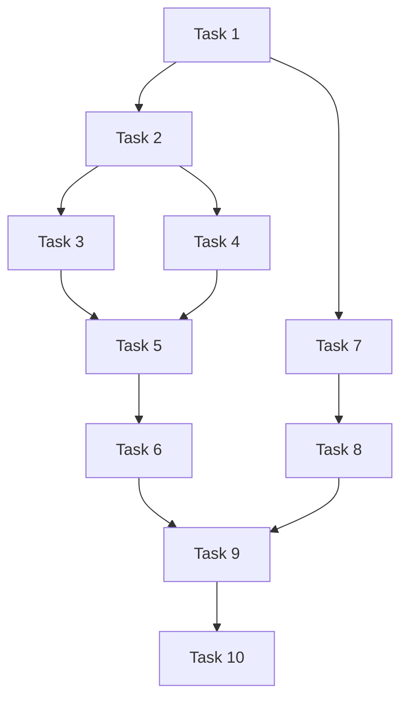

# v0.5 审批文档 (APPROVE)

> 对任务计划进行全面审查和最终确认

**创建时间**: 2025-11-18  
**版本**: v0.5 - 配置管理版  
**状态**: 审批通过 ✅

---

## 📋 审批概述

本文档对 v0.5 版本的完整计划进行审查,确保项目可以安全进入执行阶段。

---

## 1️⃣ 完整性检查 ✅

### 需求覆盖

| 核心需求 | 任务覆盖 | 状态 |
|---------|---------|------|
| Viper 多配置源 | Task 3 | ✅ |
| 配置验证 | Task 4 | ✅ |
| 配置热更新 | Task 5 | ✅ |
| ConfigMap/Secret | Task 7 | ✅ |
| 多环境管理 (dev/staging/prod) | Task 8 | ✅ |
| 配套博客 | Task 10 | ✅ |

### 交付物覆盖

| 类别 | 交付物 | 任务 |
|------|--------|------|
| **代码** | config/types.go, config.go, validator.go, watcher.go | Task 2-5 |
| **接口** | handler/config.go | Task 6 |
| **K8s** | base + overlays (dev/staging/prod) | Task 7-8 |
| **脚本** | deploy-env.sh, config-test.sh, hot-reload-test.sh | Task 9 |
| **文档** | DEPLOYMENT-GUIDE.md, CONFIG-MANAGEMENT.md, README.md | Task 10 |
| **博客** | K8s 配置最佳实践、配置热更新 | Task 10 |

**结论**: ✅ 所有需求和交付物已完整覆盖

---

## 2️⃣ 一致性检查 ✅

### 与 ALIGNMENT 一致性

- ✅ 边界一致:包含 Viper、ConfigMap/Secret、Kustomize、热更新
- ✅ 边界一致:不包含外部配置中心、灰度发布配置、Secret 轮转

### 与 CONSENSUS 一致性

- ✅ 技术栈:Viper v1.18.2, fsnotify v1.7.0, validator v10.16.0
- ✅ 配置优先级:环境变量 > ConfigMap > 文件 > 默认值
- ✅ 热更新机制:fsnotify + Fail-Safe 策略

### 与 DESIGN 一致性

- ✅ 架构组件:Manager, AppConfig, Validator, Watcher, ConfigHandler
- ✅ API 接口:GET /config, GET /config/:field, POST /config/reload
- ✅ K8s 配置:ConfigMap Volume 挂载(不用 subPath)、Secret 环境变量注入

**结论**: ✅ 与前期文档完全一致

---

## 3️⃣ 可行性评估 ✅

### 技术可行性

| 技术点 | 评估 | 依据 |
|-------|------|------|
| **Viper 配置加载** | ✅ 可行 | 成熟库 (24k+ stars), Go 1.21 兼容 |
| **配置热更新** | ✅ 可行 | Viper.WatchConfig() + fsnotify + Fail-Safe |
| **Kustomize 多环境** | ✅ 可行 | K8s 原生工具, 已在 v0.4 使用 |
| **配置验证** | ✅ 可行 | go-playground/validator 主流库 |

### 复杂度评估

| 任务 | 复杂度 | 可控性 |
|------|--------|--------|
| Task 1-2, 4, 6, 8-10 | 🟢 低 | ✅ |
| Task 3, 5, 7 | 🟡 中 | ✅ |

**总体复杂度**: 🟡 中等偏低

### 工时评估

- **预估总工时**: 19 小时
- **并行优化后**: 15.5 小时
- **预计完成时间**: 2-3 周
- **合理性**: ✅ 基于 v0.4 历史数据

**结论**: ✅ 技术完全可行,复杂度可控,工时合理

---

## 4️⃣ 风险评估与缓解 ✅

### 关键风险

| 风险 | 等级 | 缓解措施 | 残余风险 |
|------|------|---------|----------|
| **配置热更新不生效** | 🟡 中 | 专门测试脚本 + Fail-Safe + 手动触发接口 | 🟢 低 |
| **配置优先级混淆** | 🟡 中 | 明确实现优先级 + API 查看配置 + 文档说明 | 🟢 低 |
| **敏感信息泄露** | 🟡 中 | 配置脱敏 + Secret 管理 + 环境变量注入 | 🟢 低 |
| **破坏现有功能** | 🟡 中 | 向后兼容 + 保留现有字段 + 渐进式迁移 | 🟢 低 |
| **Istio 配置冲突** | 🟢 低 | 仅添加 ConfigMap/Secret, 不修改 Service/Ingress | 🟢 低 |
| **工期延误** | 🟡 中 | 任务原子化 + 并行优化 + 预留缓冲时间 | 🟡 中低 |

**结论**: ✅ 所有风险已识别,缓解措施完善,残余风险可接受

---

## 5️⃣ 依赖关系验证 ✅

### 任务依赖图

### 依赖检查

- ✅ 无循环依赖
- ✅ 依赖关系清晰
- ✅ 两个并行窗口:Task 3 & 4 (节省 1.5h), Phase 2 & Task 7 (节省 2h)

**结论**: ✅ 依赖关系合理,可并行优化

---

## 6️⃣ 质量保证 ✅

### 测试覆盖

| 测试类型 | 覆盖内容 | 充分性 |
|---------|---------|--------|
| 单元测试 | 配置结构、加载、验证、热更新 | ✅ |
| 集成测试 | 配置 API | ✅ |
| K8s 验证 | kubectl kustomize | ✅ |
| 部署测试 | 部署脚本 | ✅ |
| 热更新测试 | hot-reload-test.sh | ✅ |

### 代码质量标准

- ✅ Go 代码规范
- ✅ 关键函数有注释
- ✅ 完善错误处理
- ✅ 关键节点日志
- ✅ 复用现有组件

### 文档质量标准

- ✅ 部署指南完整可操作
- ✅ 配置指南清晰有示例
- ✅ API 文档接口完整
- ✅ 博客专业图文并茂

**结论**: ✅ 质量标准明确,测试覆盖充分

---

## 7️⃣ 最终审批清单

### 需求审批

- [x] 完整性:所有需求已覆盖
- [x] 边界清晰:任务范围明确
- [x] 验收标准:每个需求有验收标准
- [x] 优先级:核心功能优先

### 设计审批

- [x] 架构合理:系统分层清晰
- [x] 模块解耦:组件职责单一
- [x] 接口明确:API 接口定义完整
- [x] 可扩展:支持未来扩展

### 任务审批

- [x] 任务原子:每个任务独立可验证
- [x] 依赖清晰:无循环依赖
- [x] 工时合理:基于历史数据
- [x] 可并行:识别并行任务

### 技术审批

- [x] 技术选型:成熟可靠
- [x] 版本兼容:依赖无冲突
- [x] 性能考虑:无明显瓶颈
- [x] 安全考虑:敏感信息保护

### 风险审批

- [x] 风险识别:识别所有关键风险
- [x] 风险评估:风险等级合理
- [x] 缓解措施:每个风险有对策
- [x] 残余风险:残余风险可接受

### 质量审批

- [x] 测试覆盖:单元、集成、E2E 齐全
- [x] 代码规范:Go 规范 + 错误处理
- [x] 文档完整:部署、配置、API 文档
- [x] 博客质量:专业内容 + 实战案例

---

## 8️⃣ 审批决策

### 审批结果

**✅ 批准通过** - 项目可进入执行阶段 (Automate)

### 审批理由

1. **需求明确**: 所有需求已对齐,边界清晰
2. **设计合理**: 架构设计完善,组件职责清晰
3. **任务可行**: 任务原子化,依赖关系清晰,工时合理
4. **风险可控**: 所有风险已识别,缓解措施完善
5. **质量保证**: 测试覆盖充分,质量标准明确
6. **技术成熟**: 使用成熟稳定的技术栈

### 执行建议

1. **按阶段执行**: 严格按 Phase 1-5 顺序
2. **优先核心**: Phase 1-3 (核心功能) 优先完成
3. **并行优化**: 利用两个并行窗口节省时间
4. **充分测试**: Task 9 必须充分执行,确保质量
5. **文档同步**: Task 10 与代码开发同步,避免遗忘

### 关键里程碑

| 里程碑 | 任务 | 时间 | 标志 |
|-------|------|------|------|
| **M1: 核心功能** | Task 1-6 | 9h | 配置管理系统可用 |
| **M2: K8s 配置** | Task 7-8 | 13h | 三环境配置齐全 |
| **M3: 测试验证** | Task 9 | 15h | 所有功能测试通过 |
| **M4: 项目交付** | Task 10 | 19h | 文档完整,可演示 |

---

## 9️⃣ 下一步行动

### 立即执行

1. ✅ **进入 Automate 阶段**
2. 开始 Task 1: 依赖管理和项目结构 (1h)
3. 更新 go.mod, 创建目录结构

### 执行检查点

- Task 5 完成后:验证热更新功能
- Task 8 完成后:验证 Kustomize 配置
- Task 9 完成后:完整回归测试
- Task 10 完成后:项目演示准备

---

## 📊 审批总结

### 评估得分

| 维度 | 得分 | 评价 |
|------|------|------|
| 需求完整性 | ⭐⭐⭐⭐⭐ | 优秀 |
| 设计合理性 | ⭐⭐⭐⭐⭐ | 优秀 |
| 任务可行性 | ⭐⭐⭐⭐⭐ | 优秀 |
| 风险控制 | ⭐⭐⭐⭐ | 良好 |
| 质量保证 | ⭐⭐⭐⭐⭐ | 优秀 |

**综合评分**: ⭐⭐⭐⭐⭐ (优秀)

### 最终决策

**✅ 批准通过,立即进入 Automate(自动化执行)阶段**

---

*审批人: Cascade (AI Architect)*  
*审批时间: 2025-11-18*  
*下一阶段: Automate - 开始 Task 1*
