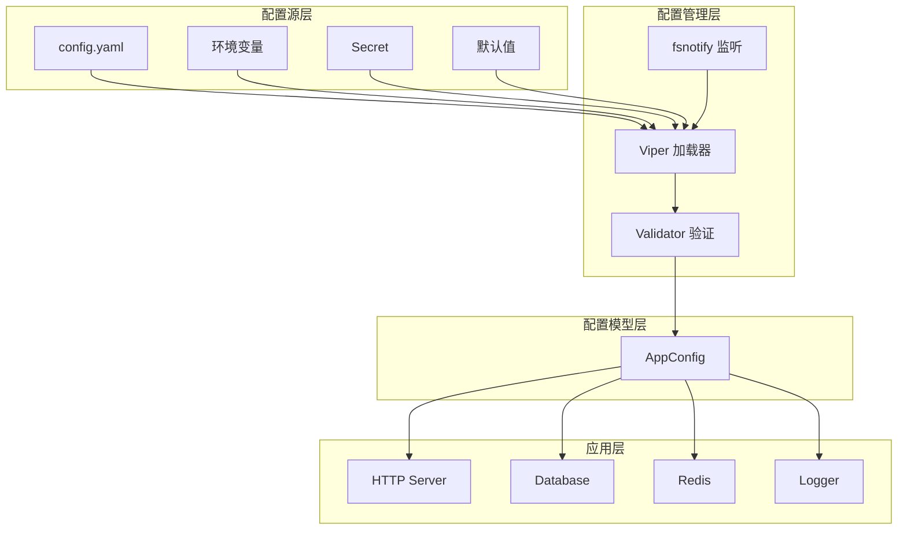
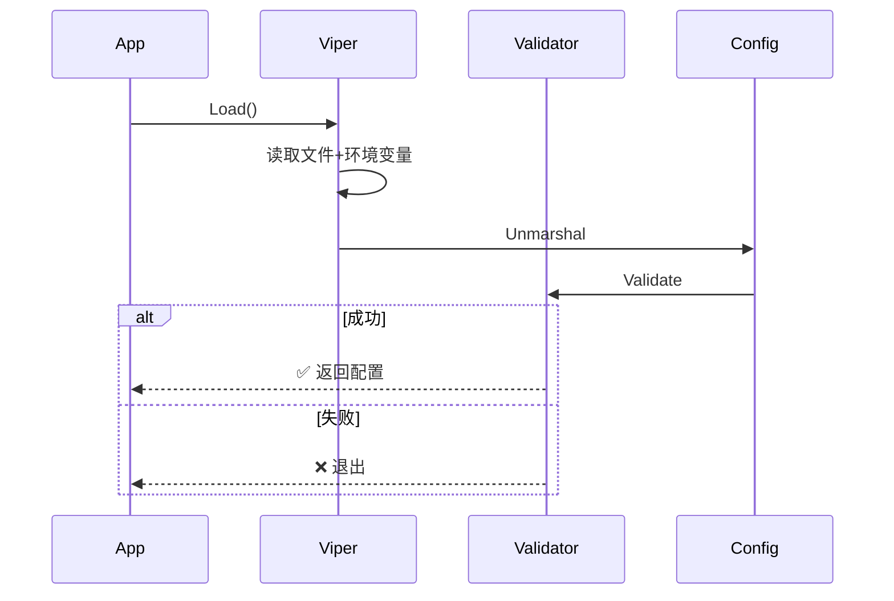
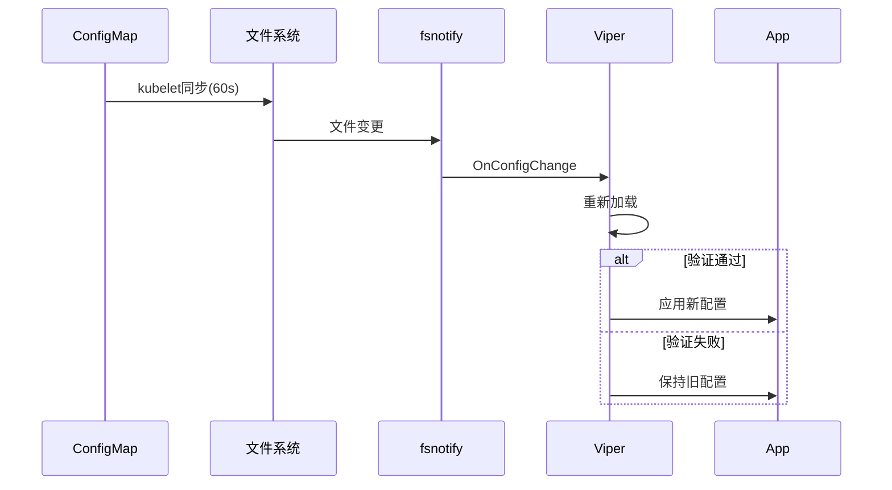
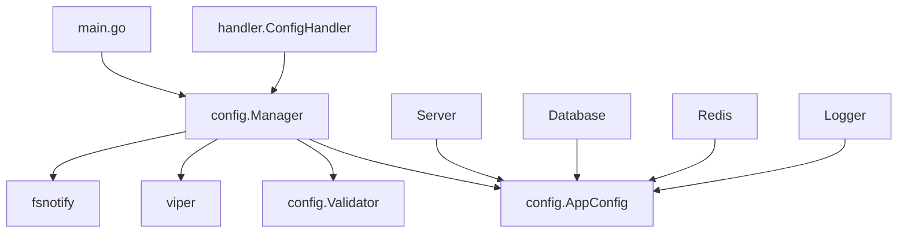

# v0.5 架构设计文档 (DESIGN)

> 从共识文档到系统架构

**创建时间**: 2025-11-18  
**版本**: v0.5 - 配置管理版  
**状态**: 架构设计

---

## 📐 整体架构设计

### 系统分层架构图



### 配置加载流程



### 配置热更新流程



---

## 🏗️ 核心模块设计

### 1. 配置管理器 (config/config.go)

**职责**: 配置加载、验证、热更新

**核心方法**:
- `Load()` - 启动时加载配置
- `Watch()` - 监听配置变化
- `OnChange()` - 注册变更回调
- `GetConfig()` - 获取当前配置

**配置优先级**: 环境变量 > ConfigMap > 配置文件 > 默认值

### 2. 配置结构体 (config/types.go)

**AppConfig 结构**:
```go
type AppConfig struct {
    Server   ServerConfig
    Database DatabaseConfig
    Redis    RedisConfig
    Log      LogConfig
    Features FeatureFlags
}
```

**验证规则**:
- 使用 `mapstructure` tag 映射 YAML 字段
- 使用 `validate` tag 验证字段值
- 自定义业务逻辑验证

### 3. 配置验证器 (config/validator.go)

**验证类型**:
1. **结构验证**: 字段类型、必填、范围
2. **业务验证**: 环境约束、依赖关系
3. **安全验证**: 敏感信息检查

**验证时机**:
- **启动时**: 严格验证，失败则退出
- **运行时**: 宽松验证，失败则保持旧配置

### 4. 热更新支持

**支持热更新的配置**:
- ✅ 日志级别
- ✅ 功能开关
- ✅ 超时时间

**不支持热更新的配置**:
- ❌ 服务器端口
- ❌ Redis/数据库地址

---

## 🌐 API 接口设计

### 配置查询接口

```
GET /api/v1/config
返回: 当前配置（脱敏）

GET /api/v1/config/:field
返回: 特定字段的值

GET /api/v1/config/hot-reloadable
返回: 支持热更新的配置项列表
```

### 配置管理接口

```
POST /api/v1/config/reload
功能: 手动触发配置重载
```

---

## 📦 Kubernetes 配置架构

### ConfigMap 设计

**用途**: 存储非敏感配置

**挂载方式**: Volume（支持热更新）

**路径**: `/etc/config/config.yaml`

### Secret 设计

**用途**: 存储敏感信息（密码、API Key）

**注入方式**: 环境变量（最高优先级）

**安全**: stringData 自动 base64 编码

### Kustomize 多环境

**目录结构**:
```
base/          # 通用配置
overlays/
  ├── dev/     # 开发环境（1副本，debug日志）
  ├── staging/ # 预发环境（2副本，info日志）
  └── prod/    # 生产环境（3副本，warn日志）
```

**差异管理**:
- 副本数
- 资源限制
- 日志级别
- 镜像标签

---

## 🔄 数据流向图

```mermaid
graph LR
    A[kubectl apply] --> B[ConfigMap]
    B --> C[kubelet]
    C --> D[Volume挂载]
    D --> E[/etc/config]
    E --> F[fsnotify]
    F --> G[Viper]
    G --> H[AppConfig]
    H --> I[应用组件]
```

---

## 🛡️ 异常处理策略

### 1. 启动时配置加载失败

**策略**: Fail-Fast（快速失败）

**行为**:
- 记录错误日志
- 退出进程（exit code 1）
- Kubernetes 自动重启 Pod

### 2. 运行时配置更新失败

**策略**: Fail-Safe（安全失败）

**行为**:
- 记录警告日志
- 保持旧配置
- 继续提供服务

### 3. 配置验证失败

**策略**: 详细错误提示

**行为**:
- 输出具体的验证错误
- 指出哪个字段不符合要求
- 提供修复建议

---

## 📊 模块依赖关系



---

## ⚙️ 技术实现细节

### 配置优先级实现

Viper 自动处理优先级（从高到低）:
1. 环境变量 (AutomaticEnv)
2. ConfigMap (ReadInConfig)
3. 默认值 (SetDefault)

### 热更新实现

1. Viper 内置 WatchConfig
2. fsnotify 监听文件变化
3. 触发 OnConfigChange 回调
4. 应用验证新配置
5. 通知订阅者

### 配置脱敏

API 接口返回配置时:
- 密码字段显示为 `******`
- API Key 部分隐藏
- 其他敏感信息过滤

---

## 📝 设计原则

### 1. 单一职责

每个模块职责明确:
- Manager: 管理配置生命周期
- Validator: 负责验证
- Types: 定义数据结构

### 2. 开闭原则

支持扩展:
- 可注册多个 Validator
- 可注册多个 OnChange 回调
- 可扩展配置结构

### 3. 依赖倒置

依赖抽象而非具体:
- Validator 是接口
- 可替换不同的验证实现

### 4. 最小权限

- ConfigMap 只读挂载
- Secret 只授权必要的 Pod
- 配置文件权限 644

---

## 🎯 架构设计总结

### 核心特性

✅ **统一配置管理** - Viper 管理所有配置源
✅ **配置热更新** - 无需重启即可生效
✅ **多环境支持** - Kustomize 管理差异
✅ **安全性** - Secret 管理敏感信息
✅ **可观测性** - 配置变更日志记录
✅ **验证机制** - 启动时和运行时验证

### 技术栈

- **Viper v1.18.2** - 配置管理
- **fsnotify v1.7.0** - 文件监听
- **validator v10.16.0** - 配置验证
- **Kustomize 5.0+** - 多环境管理

### 下一步

进入 **Atomize（任务分解）阶段**

---

*生成时间: 2025-11-18*
*基于: CONSENSUS_v0.5.md*
