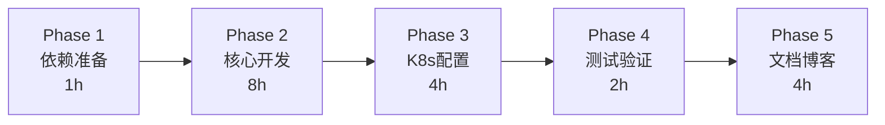
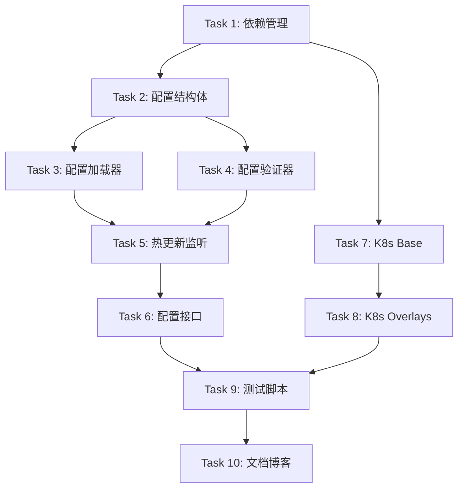

# v0.5 任务分解文档 (TASK)

> 从架构设计到原子任务

**创建时间**: 2025-11-18  
**版本**: v0.5 - 配置管理版  
**状态**: 任务分解

---

## 📊 任务总览

### 任务统计

- **总任务数**: 10 个原子任务
- **预计总工时**: 17-19 小时
- **并行任务**: 部分任务可并行执行
- **串行任务**: 部分任务有依赖关系

### 执行阶段



---

## 📋 任务依赖图



---

## 🎯 Phase 1: 依赖准备（1 小时）

### Task 1: 依赖管理和项目结构

**优先级**: P0  
**预计时间**: 1 小时  
**依赖**: 无  
**并行度**: 独立任务

#### 输入契约
- 现有 go.mod 文件
- 现有项目结构

#### 输出契约
- 新增 Viper、fsnotify、validator 依赖
- 创建 config 目录结构
- 创建配置文件示例

#### 实现任务

**1.1 更新 go.mod**
```bash
go get github.com/spf13/viper@v1.18.2
go get github.com/fsnotify/fsnotify@v1.7.0
go get github.com/go-playground/validator/v10@v10.16.0
```

**1.2 创建目录结构**
```
src/backend/config/
config/
k8s/v0.5/
  ├── base/
  └── overlays/
      ├── dev/
      ├── staging/
      └── prod/
scripts/v0.5/
docs/v0.5/
blog/v0.5/
```

**1.3 创建配置文件模板**
- config/config.yaml
- config/config.dev.yaml
- config/config.staging.yaml
- config/config.prod.yaml
- config/.env.example

#### 验收标准
- [ ] go.mod 包含所有新依赖
- [ ] go.sum 已更新
- [ ] 目录结构创建完成
- [ ] 配置文件模板存在

---

## 🎯 Phase 2: 核心开发（8 小时）

### Task 2: 配置结构体定义

**优先级**: P0  
**预计时间**: 1.5 小时  
**依赖**: Task 1  
**并行度**: 独立任务

#### 输入契约
- DESIGN_v0.5.md 中的配置结构设计
- 现有 config/config.go 文件

#### 输出契约
- config/types.go 文件
- 完整的配置结构体定义
- mapstructure 和 validate tag

#### 实现任务

**2.1 定义 AppConfig 结构体**
```go
type AppConfig struct {
    Server   ServerConfig   `mapstructure:"server"`
    Database DatabaseConfig `mapstructure:"database"`
    Redis    RedisConfig    `mapstructure:"redis"`
    Log      LogConfig      `mapstructure:"log"`
    Features FeatureFlags   `mapstructure:"features"`
}
```

**2.2 定义子配置结构体**
- ServerConfig
- DatabaseConfig
- RedisConfig
- LogConfig
- FeatureFlags

**2.3 添加验证规则**
- 使用 validate tag
- 定义字段约束

#### 验收标准
- [ ] types.go 文件创建
- [ ] 所有结构体定义完整
- [ ] 所有字段有 mapstructure tag
- [ ] 关键字段有 validate tag
- [ ] 代码可编译

---

### Task 3: 配置加载器实现

**优先级**: P0  
**预计时间**: 2 小时  
**依赖**: Task 2  
**并行度**: 依赖 Task 2

#### 输入契约
- config/types.go
- Viper 依赖

#### 输出契约
- config/config.go（Manager）
- config/default.go（默认值）
- 配置加载逻辑

#### 实现任务

**3.1 实现 Manager 结构体**
```go
type Manager struct {
    viper       *viper.Viper
    config      *AppConfig
    validators  []Validator
    onChange    []func(*AppConfig)
}
```

**3.2 实现 Load() 方法**
- 设置配置文件路径
- 设置环境变量
- 读取配置文件
- 反序列化
- 验证配置

**3.3 实现 GetConfig() 方法**
- 返回当前配置

**3.4 实现默认值设置**
- config/default.go
- setDefaults() 函数

#### 验收标准
- [ ] config.go 文件创建
- [ ] Manager 实现完整
- [ ] Load() 方法可用
- [ ] 默认值设置完整
- [ ] 单元测试通过

---

### Task 4: 配置验证器实现

**优先级**: P0  
**预计时间**: 1.5 小时  
**依赖**: Task 2  
**并行度**: 可与 Task 3 并行

#### 输入契约
- config/types.go
- validator 依赖

#### 输出契约
- config/validator.go
- 配置验证逻辑

#### 实现任务

**4.1 定义 Validator 接口**
```go
type Validator interface {
    Validate(cfg *AppConfig) error
}
```

**4.2 实现 DefaultValidator**
- 使用 go-playground/validator
- 结构验证
- 业务逻辑验证

**4.3 实现验证规则**
- 字段类型验证
- 范围验证
- 环境约束验证
- 依赖关系验证

#### 验收标准
- [ ] validator.go 文件创建
- [ ] Validator 接口定义
- [ ] DefaultValidator 实现
- [ ] 验证规则完整
- [ ] 单元测试通过

---

### Task 5: 配置热更新实现

**优先级**: P0  
**预计时间**: 2 小时  
**依赖**: Task 3, Task 4  
**并行度**: 依赖前置任务

#### 输入契约
- config/config.go（Manager）
- config/validator.go
- fsnotify 依赖

#### 输出契约
- config/watcher.go
- 热更新逻辑
- 配置变更通知

#### 实现任务

**5.1 实现 Watch() 方法**
- 使用 Viper.WatchConfig()
- 注册 OnConfigChange 回调

**5.2 实现 reload() 方法**
- 重新解析配置
- 验证新配置
- 比较配置差异
- 应用新配置
- 通知订阅者

**5.3 实现 diff() 方法**
- 比较新旧配置
- 返回变更列表

**5.4 实现 OnChange() 方法**
- 注册配置变更回调

#### 验收标准
- [ ] watcher.go 文件创建
- [ ] Watch() 方法实现
- [ ] reload() 方法实现
- [ ] diff() 方法实现
- [ ] 热更新功能可用
- [ ] 集成测试通过

---

### Task 6: 配置管理接口

**优先级**: P1  
**预计时间**: 1 小时  
**依赖**: Task 5  
**并行度**: 依赖前置任务

#### 输入契约
- config/config.go（Manager）
- handler 包结构

#### 输出契约
- handler/config.go
- 配置查询接口
- 配置管理接口

#### 实现任务

**6.1 实现 ConfigHandler**
```go
type ConfigHandler struct {
    manager *config.Manager
}
```

**6.2 实现接口方法**
- GetConfig() - GET /api/v1/config
- GetConfigField() - GET /api/v1/config/:field
- ReloadConfig() - POST /api/v1/config/reload
- GetHotReloadable() - GET /api/v1/config/hot-reloadable

**6.3 实现配置脱敏**
- sanitizeConfig() 函数
- 隐藏敏感信息

**6.4 更新 main.go**
- 使用新配置系统
- 注册配置接口
- 注册热更新回调

#### 验收标准
- [ ] handler/config.go 创建
- [ ] 所有接口实现
- [ ] 配置脱敏功能
- [ ] main.go 更新完成
- [ ] 接口测试通过

---

## 🎯 Phase 3: K8s 配置（4 小时）

### Task 7: K8s Base 配置

**优先级**: P0  
**预计时间**: 2 小时  
**依赖**: Task 1  
**并行度**: 可与 Phase 2 并行

#### 输入契约
- DESIGN_v0.5.md 中的 K8s 设计
- 现有 k8s 配置参考

#### 输出契约
- k8s/v0.5/base/ 目录下所有文件
- kustomization.yaml
- deployment.yaml
- service.yaml
- configmap.yaml
- secret-template.yaml

#### 实现任务

**7.1 创建 kustomization.yaml**
- 定义资源列表
- 定义通用标签

**7.2 创建 deployment.yaml**
- 定义 Deployment
- ConfigMap Volume 挂载
- Secret 环境变量注入
- 健康检查
- 资源限制

**7.3 创建 service.yaml**
- 定义 Service
- 端口映射

**7.4 创建 configmap.yaml**
- 定义 ConfigMap
- config.yaml 内容

**7.5 创建 secret-template.yaml**
- Secret 模板
- 敏感信息占位符

**7.6 创建 README.md**
- Base 配置说明

#### 验收标准
- [ ] 所有 YAML 文件创建
- [ ] kustomization.yaml 正确
- [ ] ConfigMap 挂载正确（不用 subPath）
- [ ] Secret 注入正确
- [ ] kubectl kustomize 验证通过

---

### Task 8: K8s Overlays 配置

**优先级**: P0  
**预计时间**: 2 小时  
**依赖**: Task 7  
**并行度**: 依赖 Task 7

#### 输入契约
- k8s/v0.5/base/
- 环境差异配置需求

#### 输出契约
- overlays/dev/ 完整配置
- overlays/staging/ 完整配置
- overlays/prod/ 完整配置

#### 实现任务

**8.1 创建 dev 环境配置**
- kustomization.yaml
- config.yaml（debug 日志）
- patches/replica.yaml（1 副本）
- patches/resources.yaml（小资源）
- README.md

**8.2 创建 staging 环境配置**
- kustomization.yaml
- config.yaml（info 日志）
- patches/replica.yaml（2 副本）
- patches/resources.yaml（中资源）
- README.md

**8.3 创建 prod 环境配置**
- kustomization.yaml
- config.yaml（warn 日志）
- patches/replica.yaml（3 副本）
- patches/resources.yaml（大资源）
- README.md

**8.4 创建总 README.md**
- v0.5 K8s 配置概述
- 使用说明

#### 验收标准
- [ ] 三个环境配置完整
- [ ] 配置差异正确
- [ ] kubectl kustomize 验证通过
- [ ] README.md 清晰

---

## 🎯 Phase 4: 测试验证（2 小时）

### Task 9: 测试脚本开发

**优先级**: P1  
**预计时间**: 2 小时  
**依赖**: Task 6, Task 8  
**并行度**: 依赖前置任务

#### 输入契约
- 完整的代码实现
- 完整的 K8s 配置

#### 输出契约
- scripts/v0.5/deploy-env.sh
- scripts/v0.5/config-test.sh
- scripts/v0.5/hot-reload-test.sh
- scripts/v0.5/README.md

#### 实现任务

**9.1 开发部署脚本**
```bash
# deploy-env.sh
# 功能：部署指定环境
# 用法：./deploy-env.sh [dev|staging|prod]
```

**9.2 开发配置测试脚本**
```bash
# config-test.sh
# 功能：测试配置加载和验证
# 用法：./config-test.sh
```

**9.3 开发热更新测试脚本**
```bash
# hot-reload-test.sh
# 功能：测试配置热更新
# 步骤：
# 1. 获取当前配置
# 2. 更新 ConfigMap
# 3. 等待 120 秒
# 4. 验证配置已更新
```

**9.4 创建脚本 README**
- 脚本使用说明
- 测试流程

#### 验收标准
- [ ] 所有脚本创建
- [ ] 脚本可执行
- [ ] 错误处理完善
- [ ] 测试通过

---

## 🎯 Phase 5: 文档和博客（4 小时）

### Task 10: 文档编写和博客创作

**优先级**: P1  
**预计时间**: 4 小时  
**依赖**: Task 9  
**并行度**: 依赖前置任务

#### 输入契约
- 所有代码和配置完成
- 测试脚本完成

#### 输出契约
- docs/v0.5/DEPLOYMENT-GUIDE.md
- docs/v0.5/CONFIG-MANAGEMENT.md
- docs/v0.5/README.md
- blog/v0.5/15-k8s-config-best-practices.md
- blog/v0.5/16-config-hot-reload.md

#### 实现任务

**10.1 编写部署指南**
- 环境准备
- 本地开发部署
- K8s 多环境部署
- 故障排查

**10.2 编写配置管理指南**
- Viper 使用说明
- 配置优先级
- 热更新机制
- 最佳实践

**10.3 编写版本概述**
- v0.5 总体介绍
- 核心功能
- 快速开始

**10.4 创作博客 1**
- 标题：《K8s 配置管理最佳实践》
- 内容：
  - ConfigMap vs Secret
  - Volume 挂载 vs 环境变量
  - Kustomize 多环境管理
  - 实战案例

**10.5 创作博客 2**
- 标题：《实现配置热更新：无需重启服务》
- 内容：
  - 配置热更新原理
  - Viper + fsnotify 实现
  - K8s ConfigMap 同步机制
  - 实战演示

#### 验收标准
- [ ] 所有文档完成
- [ ] 文档结构清晰
- [ ] 代码示例正确
- [ ] 博客内容专业
- [ ] 图表准确美观

---

## 📊 任务执行时间线

### 预估时间分配

| Phase | 任务 | 时间 | 累计 |
|-------|------|------|------|
| **Phase 1** | Task 1: 依赖准备 | 1h | 1h |
| **Phase 2** | Task 2: 配置结构体 | 1.5h | 2.5h |
|  | Task 3: 配置加载器 | 2h | 4.5h |
|  | Task 4: 配置验证器 | 1.5h | 6h |
|  | Task 5: 热更新监听 | 2h | 8h |
|  | Task 6: 配置接口 | 1h | 9h |
| **Phase 3** | Task 7: K8s Base | 2h | 11h |
|  | Task 8: K8s Overlays | 2h | 13h |
| **Phase 4** | Task 9: 测试脚本 | 2h | 15h |
| **Phase 5** | Task 10: 文档博客 | 4h | 19h |

### 并行执行优化

**并行窗口 1**（Task 3 和 Task 4）
- Task 3 和 Task 4 可并行
- 节省 1.5 小时

**并行窗口 2**（Phase 2 和 Task 7）
- Task 7 可在 Phase 2 期间开始
- 节省 2 小时

**优化后总时间**: 约 15.5 小时

---

## ✅ 任务验收检查清单

### 代码验收

- [ ] 所有 Go 文件可编译
- [ ] 所有导入包正确
- [ ] 代码符合 Go 规范
- [ ] 关键函数有注释
- [ ] 错误处理完善
- [ ] 日志输出清晰

### 功能验收

- [ ] Viper 配置加载成功
- [ ] 配置验证功能正常
- [ ] 热更新功能正常
- [ ] 配置接口可用
- [ ] 配置脱敏正确

### K8s 验收

- [ ] Base 配置正确
- [ ] Overlays 配置正确
- [ ] ConfigMap 挂载成功
- [ ] Secret 注入成功
- [ ] 三个环境可部署

### 测试验收

- [ ] 单元测试通过
- [ ] 集成测试通过
- [ ] 热更新测试通过
- [ ] 部署脚本可用

### 文档验收

- [ ] 部署指南完整
- [ ] 配置指南清晰
- [ ] 博客内容专业
- [ ] 代码示例可运行

---

## 🎯 关键里程碑

### Milestone 1: 核心功能完成（9 小时）
- Task 1-6 完成
- 配置管理系统可用
- 配置接口可用

### Milestone 2: K8s 配置完成（13 小时）
- Task 7-8 完成
- 三个环境配置齐全
- 可部署到 K8s

### Milestone 3: 测试验证完成（15 小时）
- Task 9 完成
- 所有功能测试通过
- 脚本可用

### Milestone 4: 项目交付（19 小时）
- Task 10 完成
- 所有文档完成
- 项目可演示

---

## 📝 任务分解总结

### 总体规划

- **10 个原子任务**，清晰的依赖关系
- **5 个执行阶段**，循序渐进
- **17-19 小时**工作量，2-3 周完成
- **并行优化**，可节省 3.5 小时

### 质量保证

- 每个任务有明确的验收标准
- 每个阶段有里程碑检查
- 代码、功能、文档全面验收

### 风险控制

- 任务原子化，降低复杂度
- 依赖关系明确，避免阻塞
- 并行任务识别，提高效率

### 下一步

进入 **Approve（审批）阶段**，人工审查任务分解

---

*生成时间: 2025-11-18*
*基于: DESIGN_v0.5.md*
